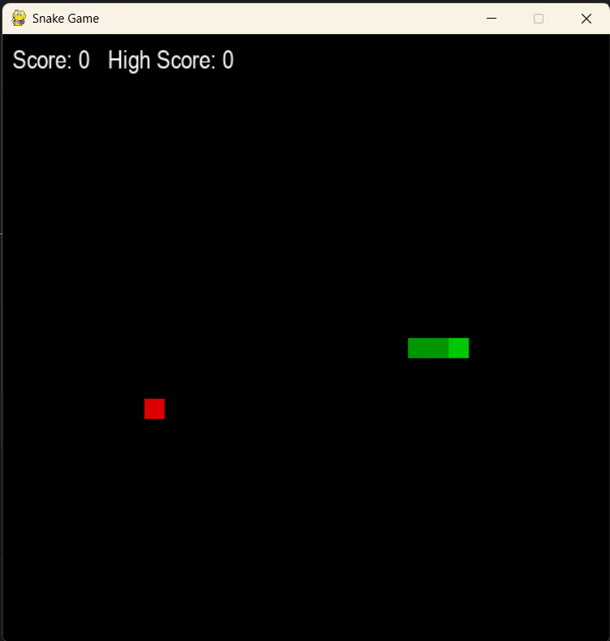
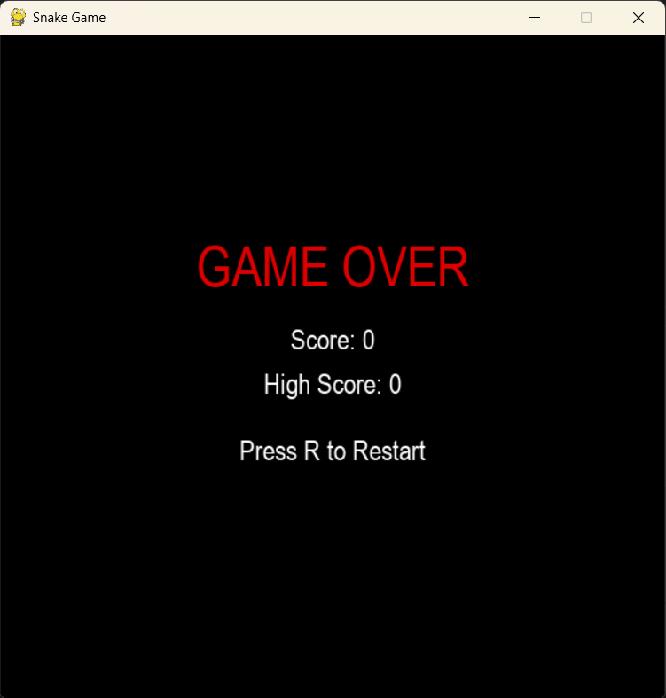

# 🐍 Snake Game

A classic **Snake Game built with Python and Pygame**.

Control the snake, eat the food, grow longer, and try to beat your high score! The game includes collision detection, score tracking, and a persistent high-score system.

## 🎮 Features

* 🐍 Classic Snake gameplay
* 🍎 Randomly generated food
* 📊 Live score tracking
* 🏆 Persistent high score
* 💾 High score saved automatically
* 💥 Wall collision detection
* 🐍 Self-collision detection
* 🔄 Restart the game after Game Over
* 🎨 Simple and clean interface

## 🛠️ Built With

* **Python 3**
* **Pygame**
* **Random module**
* **OS module**

## 📸 Screenshots

### Gameplay



### Game Over



## 🚀 Getting Started

### Prerequisites

Make sure you have **Python 3** installed on your computer.

You can check your Python version with:

```bash
python --version
```

### Installation

1. Clone this repository:

```bash
git clone https://github.com/your-username/python-snake-game.git
```

2. Move into the project folder:

```bash
cd python-snake-game
```

3. Install Pygame:

```bash
pip install pygame
```

### ▶️ Run the Game

Start the game using:

```bash
python snake_game.py
```

The Snake Game window will open and you can start playing.

## 🎯 Controls

| Key            | Action                  |
| -------------- | ----------------------- |
| ⬆️ `↑`         | Move Up                 |
| ⬇️ `↓`         | Move Down               |
| ⬅️ `←`         | Move Left               |
| ➡️ `→`         | Move Right              |
| `R`            | Restart after Game Over |
| ❌ Close Window | Exit Game               |

## 🏆 Scoring

Every time the snake eats the food:

* Your score increases by **1**
* The snake grows longer
* A new piece of food appears

If your score is higher than the previous high score, the new high score is automatically saved in:

```text
highscore.txt
```

This means your high score can be kept even after closing the game.

## 💥 Game Over

The game ends when the snake:

* Hits the edge of the game window
* Collides with its own body

After Game Over, press **`R`** to restart the game.

## 📂 Project Structure

```text
python-snake-game/
│
├── snake_game.py
├── highscore.txt
├── README.md
│
└── screenshots/
    ├── gameplay.png
    └── game-over.png
```

## 🔮 Future Improvements

Some features I may add in future versions:

* 🔊 Sound effects and background music
* ⚡ Increasing speed as the score increases
* 🎚️ Different difficulty levels
* ⏸️ Pause and resume functionality
* 🎨 Improved graphics and animations
* 🏅 Leaderboard system
* 🍎 Different types of food
* 🏠 Start menu

## 💡 What I Learned

Through this project, I practiced:

* Python functions
* Lists and tuples
* Loops and conditional statements
* Event handling with Pygame
* Collision detection
* Random number generation
* File handling
* Saving and loading data
* Building a simple game using Python

## 👩‍💻 Author

**Amrita Priyadarshini**

---

⭐ If you like this project, feel free to star the repository!
